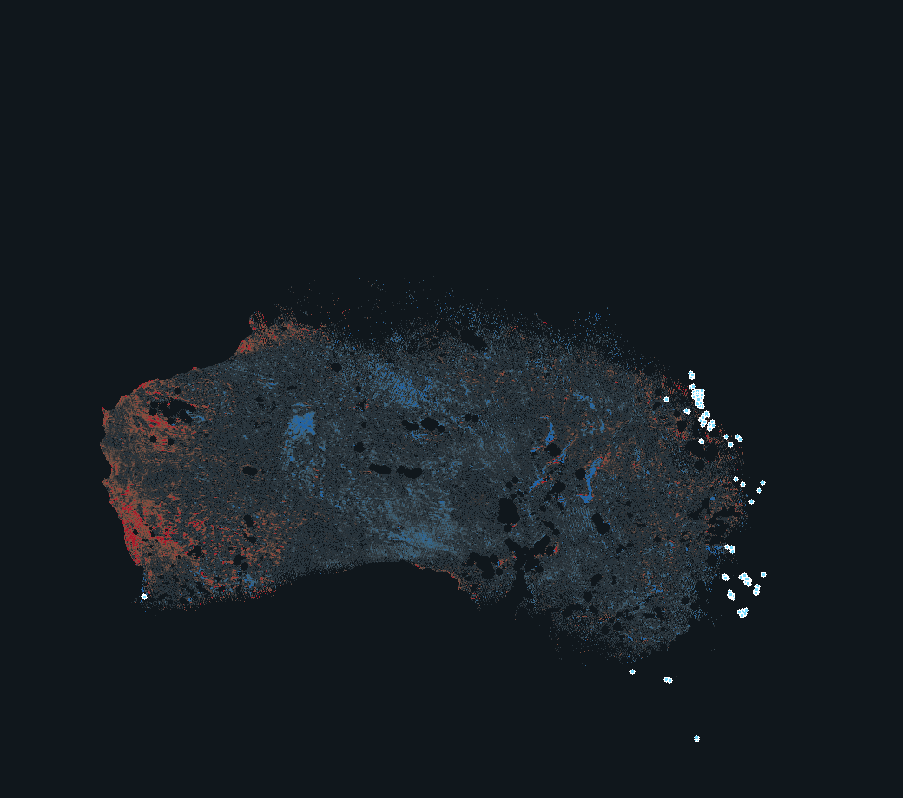

# Findings from the first TROPOMI baseline

_Measured 2026-08-15 from 20 monthly composites (2025-01 → 2026-08), 2,184 Sentinel-5P OFFL granules, zero processing failures. These are empirical results from this project's own data, and they change what the app should claim._

_20-month average column enhancement. Red is above the latitude-banded background, blue below; coastal cells excluded. Light blue rings are the 114 mapped coal mines. Note the dominant red region in southwest Western Australia — an area with no significant methane source._

## 1. Papua New Guinea is effectively invisible to TROPOMI

| Region | Cells with ≥1 usable month | Median usable months |
|---|---|---|
| Australia mainland | **58.2%** | 14 |
| Tasmania | 16.7% | 2 |
| **Papua New Guinea** | **0.2%** | 1 |
| PNG Highlands (Hides/Kutubu) | 0.5% | 1 |

Persistent tropical cloud plus dark, wet vegetation leaves almost nothing that passes a qa ≥ 0.5 filter. This was anticipated as "PNG will be sparse"; the measurement shows it is not sparse but **absent** — 0.2% coverage cannot support a concentration map, an anomaly, or a time series.

**Consequence:** the PNG half of this project cannot be served by TROPOMI at all. It must rest on point-source imagers (EMIT, Carbon Mapper) plus the infrastructure layer, which is already strong there thanks to GEM's route geometry. PNG messaging in the UI must not imply satellite concentration coverage exists.

## 2. Surface-related bias exceeds the real basin signal

20-month mean enhancement, interior land only:

| Region | Mean | p90 | Max |
|---|---|---|---|
| **WA wheatbelt (southwest)** | **+2.37 ppb** | +6.39 | +14.31 |
| Bowen Basin coal, QLD | +1.97 ppb | +5.45 | +13.13 |
| Surat Basin CSG, QLD | +1.03 ppb | +4.42 | +10.59 |
| Galilee Basin, QLD | +1.22 ppb | — | +13.13 |
| Cooper Basin, SA/QLD | −1.80 ppb | — | — |
| Amadeus Basin, NT | −1.81 ppb | — | — |
| Hunter Valley coal, NSW | — | — | (1 interior cell) |

The coal and CSG basins do come out positive, consistent with published TROPOMI work. But **the southwest WA wheatbelt — which has no significant methane source — shows a larger enhancement than Bowen Basin**, Australia's biggest coal-methane region. TROPOMI's known sensitivity to surface albedo is the likely cause, and a latitude-banded background does not remove it.

**Consequence:** this layer is honest as *observed column enhancement* and must never be labelled emissions or used to identify sources. Separating surface bias from real signal needs an albedo/elevation correction or a full inversion — which is exactly what [Open Methane](https://openmethane.org/) already does for Australia on a 10 km grid, and is the right layer to add for the "where are Australian emissions" question.

Note also that **Hunter Valley is eliminated entirely** by the coastal buffer (1 surviving interior cell) — it sits too close to the coast for this method to say anything about it.

## 3. Persistent "hotspots" were 100% coastal artifact

The persistence test — keep cells elevated ≥18 ppb in ≥50% of months with ≥8 observed months — returned 411 cells. Applying a coastal buffer of increasing width:

| Coast buffer | ~km | Cells surviving | Land retained |
|---|---|---|---|
| 0 | 0 | 411 | 100% |
| 1 | 6 | 158 | 95.5% |
| 2 | 11 | 29 | 92.3% |
| 3 | 16 | 6 | 88.9% |
| 4 | 22 | 4 | 86.3% |
| 6 | 33 | 1 | 80.8% |
| **8** | **44** | **0** | **76.1%** |

Every candidate disappears by a 44 km buffer while 76% of land is still retained, and all six survivors at 16 km sat within 16–28 km of open water. Before the filter, 13 of the top 15 hugged the shoreline with no mapped infrastructure within 100+ km — one was 404 km from the nearest pipeline.

The mechanism: a ~7 km footprint straddling a shoreline mixes bright surf, sand and water into a single retrieval, biasing it systematically. **Because the bias is systematic, it persists — so persistence alone cannot distinguish a real source from a coastal artifact.** That was the assumption the test was built on, and it was wrong.

**Consequence:** no hotspot layer is published. `hotspots.json` is retained as an analysis artifact documenting the negative result, not as a map layer.

## 4. Monthly is the floor for temporal resolution

Weekly composites give a median of **1 observation per cell**; a single retrieval's scatter is comparable to the enhancement being sought, and the first weekly pilot's top eight "hotspots" were all single-observation cells. Monthly reaches a median of 4–6, and the 20-month average brings per-cell standard error to **0.93 ppb** — the only level at which a few-ppb basin signal is measurable at all.

| Product | Per-cell noise |
|---|---|
| Weekly | ~1 obs/cell — unusable for anomaly |
| Monthly | 6.5 ppb sd, p99 14.4 ppb |
| 20-month average | **0.93 ppb** typical standard error |

## 5. Phase 2 result: the plume layer works, and it cross-validates the above

Adding point-source detections (UNEP IMEO/MARS, NASA EMIT, SRON) produced **499 plumes** over the region, of which **389 sit within 10 km of a mapped mine or gas plant** and 74 within 1 km. **89% are coal-sector.**

| Region | Plumes |
|---|---|
| **Bowen Basin, QLD** | **227** |
| **Hunter Valley, NSW** | **134** |
| Sydney Basin, NSW | 93 |
| Surat Basin, QLD | 5 |
| Cooper Basin, SA/QLD | 2 |
| **NW Shelf / Pilbara, WA** | **1** |
| **Papua New Guinea** | **0** |

Most-detected facilities, all underground coal mines: Grosvenor (33), Mandalong (30), Ashton (29), Aquila-Capcoal (27), Tower (25), Tahmoor (24), Appin (23), Kestrel (14).

**This independently confirms the TROPOMI diagnosis.** The NW Shelf, where TROPOMI's strongest and most persistent "hotspots" clustered, yields **one** plume — the enhancement there was artifact. The Hunter Valley, which TROPOMI's coastal buffer eliminated entirely (1 interior cell), yields **134** plumes. Two independent instruments disagreeing that sharply is exactly what a systematic retrieval bias looks like, and the plume data points to the geography the literature expects: gassy underground coal.

**PNG remains at zero.** Not a coverage artifact this time — the plume providers simply have no published detections there. PNG's methane story currently rests on infrastructure mapping alone.

### Rates must never be summed

Each plume carries an instantaneous rate in kg/hr from a single overpass. Adding them across 499 detections spanning three years yields ~3.4 million kg/hr, which annualises to far more than Australia's entire methane inventory — it is meaningless. Detections sample scattered moments and are biased toward large, detectable events. The pipeline records this caveat in `plumes_status.json` and the UI repeats it on every popup.

## 6. Building our own detector: attempted, validated, does not work

We implemented Sentinel-2 multi-band multi-pass detection and tested it against infrastructure-free control sites and against the 797 independently measured plumes. It fails both tests: **1.74× target-to-control ratio**, and **1 same-day coincidence out of 20 opportunities**. Ashton (37 known plumes) scores identically to NSW bushland; Appin (35 known plumes) scores identically to empty rangeland.

Nothing from it is published. Full write-up, including the three bugs found and what a working version would need, in [S2_DETECTOR.md](S2_DETECTOR.md).

The most instructive part: a tile-edge bug had been silently zeroing one control site, which made the false-positive floor look lower than it was and the ratio look like 7.5×. Fixing the *control* is what revealed the *detector* did not work.

## 7. PNG resolved: observed 44 times, no large plume

The zero-plumes-over-PNG result (§1) is now explained. Reading the existing EMIT archive — data that was already public and, as far as we can tell, unprocessed for PNG — gives **44 usable overpasses of six gas facilities between May 2024 and May 2026**, at 37% observability. **None exceeds +1σ above its scene background**; the maximum anywhere is +0.42σ.

So PNG is not unexamined, and it is not visibly leaking at scale. The bound is real but loose: this test would only catch a very large release, 63% of overpasses are lost to cloud, and chronic low-rate venting stays invisible. Full detail and caveats in [PNG_EMIT_FINDING.md](PNG_EMIT_FINDING.md).

Also corrected there: EMIT **cannot be tasked** — body-mounted on the ISS, no gimbal, no nomination route. An earlier plan to nominate PNG targets was both impossible and unnecessary.

## What this means for the build

1. **TROPOMI is regional context, not detection.** Ship it as concentration and long-term enhancement, with the surface-bias caveat visible in the UI, not buried in a methodology page.
2. **Phase 2 (point-source plumes) moves to the critical path.** Carbon Mapper reports ~271 Australian plumes since 2023 including ~51 in the Bowen Basin, each with a quantified rate. That is the layer that can actually say "this facility is emitting", and it is the only route to any PNG signal.
3. **Add Open Methane as the Australian emissions layer** (⚠️ CC BY-NC) — an inverse model is the correct instrument for the question TROPOMI concentrations cannot answer.
4. **Reported-vs-observed (Phase 3) must compare against plumes, not TROPOMI anomalies.** Comparing NGER reported methane to a column anomaly that contains more albedo artifact than signal would produce a meaningless and potentially defamatory chart.
