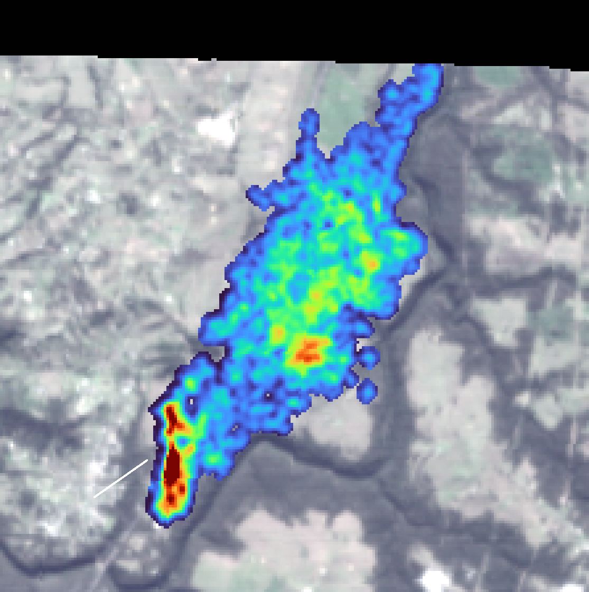

# Live monitoring: what's possible, and what isn't

_Built 2026-08-15. Covers the recency slider, plume imagery, wind context and the daily alert job._

_6,769 kg/hr at Tower colliery, NSW, 22 June 2026. Concentration raster over its own scene backdrop. The white arrow is the measured wind at that location and hour — 2.1 m/s toward 55° — and the plume drifts northeast to match, which is the first check that a detection is physically sensible._

## "Live" has a hard floor, and it isn't ours

Measured across the four providers as of 2026-08-15:

| Provider | Newest detection | Age |
|---|---|---|
| SRON | 2026-07-28 | **18 days** |
| Carbon Mapper | 2026-07-15 | 31 days |
| UNEP IMEO | 2026-06-24 | 52 days |
| NASA EMIT | 2024-02-25 | sparse over this region |

This is not pipeline lag. **Carbon Mapper and UNEP both hold detections back around 30 days by policy** — for operator notification and quality review. No amount of engineering makes a plume appear sooner than its publisher releases it.

So the honest target is not real-time. It is: *surface the newest thing available, state its age plainly, and tell you the moment something new lands.* The map now leads with "newest detection N days old" rather than letting a stale map look current.

The only genuinely fast channel is TROPOMI at 1–5 days, but at 5.5 × 7 km it cannot see facility plumes — [FINDINGS.md](FINDINGS.md) covers why.

## Recency slider

Six windows: 30 days, 90 days, 180 days, 1 year, 2 years, all time. Measured distribution:

| Window | Plumes |
|---|---|
| 30 days | 3 |
| 90 days | 63 |
| 180 days | 146 |
| 1 year | 324 |
| 2 years | 600 |
| all | 798 |

It opens on **1 year**, because a 30-day default would show three dots and read as a broken map. Filtering is a lexicographic comparison against an ISO date cutoff — provider timestamps are all ISO-prefixed, so it is exact and needs no reprocessing.

## Plume imagery

Carbon Mapper publishes per-detection rasters plus `plume_bounds`, so a plume can be drawn as what it looked like rather than as a dot:

- `plume_png` — methane concentration, colourised
- `rgb_png` — the scene backdrop
- `con_tif` — concentration values in ppm-m
- `plume_bounds` — `[west, south, east, north]` for georeferencing

Click a plume and both layers drape at those bounds. Currently **55 plumes carry imagery** (1.8 MB total, newest first); the fetch is capped because the archive runs to thousands and recency is the point.

One wrinkle worth recording: these ship as RGB with **no alpha**, on pure black covering ~90% of the frame. Draped raw, that is an opaque square blotting out the map. The colourmap starts at a dark purple (49,21,66), comfortably clear of black, so the pipeline keys near-black to transparent with a graded edge — the plume fades out instead of ending on a hard cut.

## Wind

From Open-Meteo — free, no key, hourly. Sampled at each plume's own coordinates and hour, for the 400 most recent detections. The archive API lags a few days, so recent plumes fall back to the forecast API's past-days window.

Wind earns its place twice. Direction is the first sanity check on a detection: a real plume points downwind, and the Tower colliery example above matches. And emission rate scales with wind speed, so it is the dominant term in the uncertainty of any published figure.

Stored per plume: `wind_speed_ms`, `wind_from_deg`, and `plume_toward_deg` (meteorological convention is where wind comes *from*, so drift is that plus 180).

## Daily refresh and alerts

`.github/workflows/plumes-daily.yml`, 05:00 AEST:

1. Fetch every provider
2. Diff against `plumes_seen.json` to find genuinely new detections
3. Fetch imagery and wind for the newest — `continue-on-error`, since imagery is a bonus and must never fail the refresh
4. Commit, which auto-deploys the live map
5. If anything new arrived, open a GitHub issue listing each detection with rate, nearest facility and provider

The issue is the push: GitHub emails watchers, so it reaches you without polling the site. The first run only records a baseline and stays silent, so you don't get one issue containing 798 historical plumes.

`plumes_new.json` carries the same feed as JSON for any other consumer — a webhook, Slack, or email relay is a small addition on top.

### Secrets the job needs

`CARBON_MAPPER_EMAIL` + `CARBON_MAPPER_PASSWORD` (or `CARBON_MAPPER_TOKEN`), and `EARTHDATA_TOKEN`. Without them the job still runs: UNEP and SRON need no credentials, so it degrades rather than fails.

## Honest limits

- **Nothing here is real-time.** Best case is ~18 days, set by provider policy.
- **Imagery is Carbon Mapper only.** UNEP publishes plume outlines, not rasters; SRON gives 7 km positions with no imagery.
- **Wind is modelled reanalysis**, not measured at the site — good for direction, approximate for speed.
- **A daily job cannot detect anything the providers have not published.** It shortens the gap between publication and you seeing it, which is the only part within our control.
